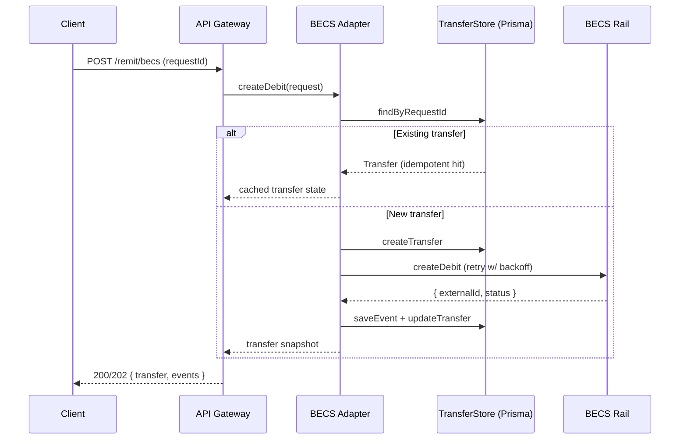

# BECS Remittance Adapter

## Sequence

## Environment variables

| Key | Description | Required | Default |
| --- | ----------- | -------- | ------- |
| `BECS_API_BASE_URL` | HTTPS endpoint for the upstream BECS provider | Yes (prod) | – |
| `BECS_API_KEY` | Bearer token used to authenticate to the BECS provider | Yes (prod) | – |
| `BECS_API_TIMEOUT_MS` | HTTP timeout (milliseconds) for BECS calls | No | `10000` |

In non-production environments the API gateway falls back to the in-memory `InMemoryBecsClient` when credentials are not supplied. Production deployments must provide the base URL and API key to reach the live rail.
