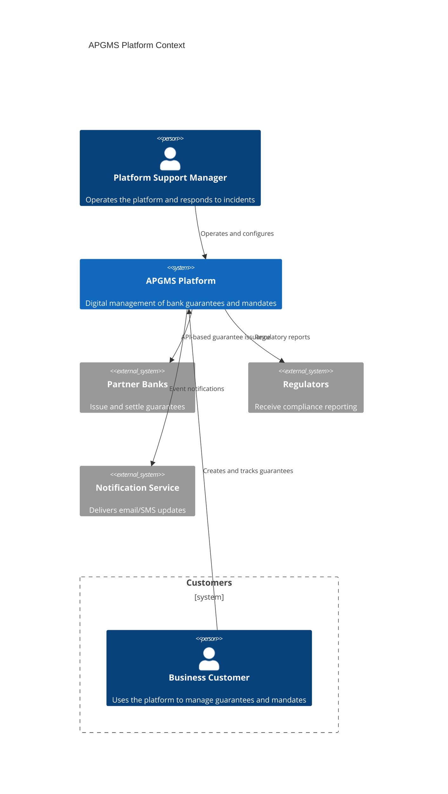
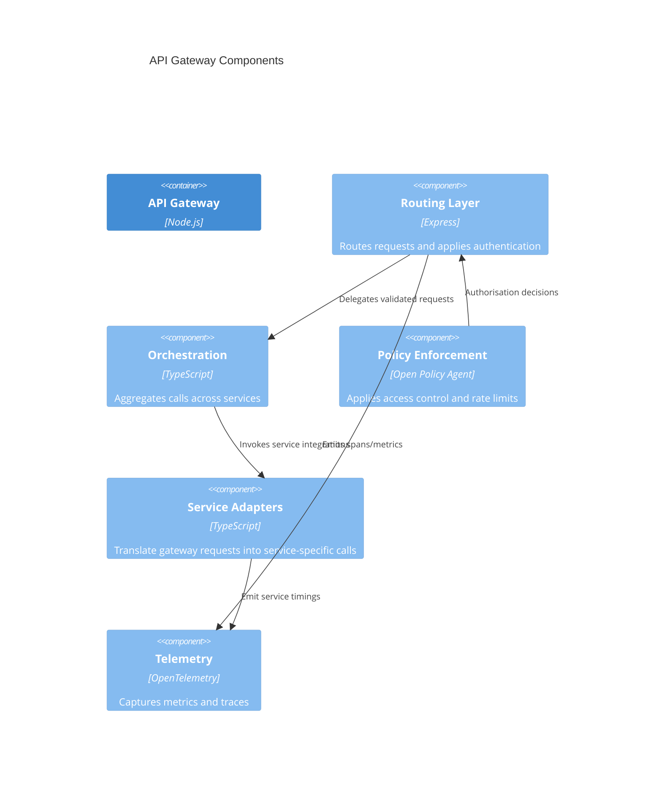

# Platform Architecture Overview

This document provides C4-style architecture views for the APGMS platform. Each diagram uses [Mermaid](https://mermaid.js.org/) syntax and can be rendered by static site generators that support Mermaid (e.g. MkDocs, Docusaurus).

## Level 1: System Context



## Level 2: Container View

```mermaid
C4Container
    title APGMS Platform Containers
    Person(customer, "Business Customer")
    Person(psm, "Platform Support Manager")

    System_Boundary(apgms, "APGMS Platform") {
        Container(web, "Customer Portal", "Next.js", "Self-service experience for customers")
        Container(api, "API Gateway", "Node.js", "Unified API surface for external and internal clients")
        Container_Boundary(services, "Domain Microservices") {
            Container(audit, "Audit Service", "Node.js", "Immutable event log and reporting")
            Container(payments, "Payments Service", "Node.js", "Settlement and reconciliation")
            Container(registries, "Registries Service", "Node.js", "Reference and compliance data")
        }
        Container(db, "Operational Data Store", "PostgreSQL", "Authoritative state for mandates and guarantees")
        Container(queue, "Message Bus", "Kafka", "Asynchronous events between services")
        Container(obs, "Observability Stack", "Grafana/Prometheus", "Metrics, logs and tracing")
    }

    Rel(customer, web, "Uses")
    Rel(web, api, "HTTPS/JSON")
    Rel(api, services, "gRPC/REST")
    Rel(services, db, "SQL")
    Rel(services, queue, "Event streaming")
    Rel(queue, services, "Async events")
    Rel(psm, obs, "Monitoring & alerting")
```

## Level 3: Component View — API Gateway



## Architectural Decision Log

| Decision | Rationale | Status |
| --- | --- | --- |
| Adopt microservices per bounded context | Enables independent scaling and deployments | Accepted |
| Use Kafka for asynchronous integration | Decouples services and improves resilience | Accepted |
| Centralise observability with OpenTelemetry | Provides consistent telemetry across services | Accepted |

